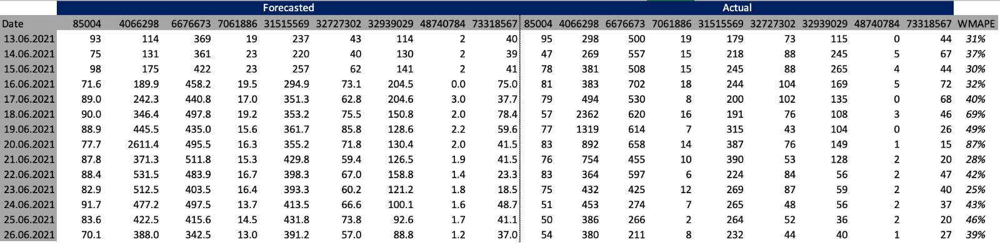
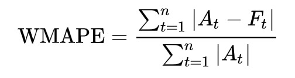

# Introduction

The fundamental focus of statistical and time series analysis is on repeating  trends and seasonalities in different variables. Online shopping has become one of the most significant areas throughout the world as the Internet has developed over the years. Trendyol is a well-known online shopping service that connects consumers and sellers on a common network. We were asked to predict the sales of nine distinct Trendyol items for this assignment. Trendyol continually delivered the essential data for the work based on the previous day's outcomes. As a result, sales predictions were established based on two-day ahead forecasts. 
The file contains historical sales data from May 25, 2020. The information included the price of products sold, the number of items sold, the number of visits to a given product, the count of favorites the product was added, the number of times the product was added to basket, the number of items sold from the same category, the number of items sold from the same brand, the number of people who visits such category, the number of items added to basket at that category, and the number of items added to favorites in a given day. For almost each day for every product, all such statistics were available. In the textile, electronics, and cosmetics categories, there were 4,2,3 items, respectively. The capacity to evaluate and understand historical data, general modeling expertise, success in picking and defining the characteristics to be utilized, patience to monitor and update the forecasting technique, and, last but not least, group cooperation are all important factors in project success.
We were able to comprehend how the sales amounts were impacted by past sales amounts after finding key patterns in the sales amounts by visually evaluating the data and inspecting it using simple plot commands as well as regression plots. Because there were distinct patterns in certain product categories, we chose to examine each one independently, without regard for the total data. Because we have discovered key patterns in product sales, we must go through the programming processes one by one and explain which prediction methods were utilized and for what reason. Initially, we sorted all of the product categories by ID numbers and divided the data into nine sections. First, we have generated two dates in which we will segregate each product category data, one for validation and the other for training the model.

# Related Literature

A time series is a set of data points that are organized in time. Time series are subjected to a variety of studies in a variety of areas, particularly financial and economic applications. The goal of using time series in this project is to be able to make significant inferences about the subject and make predictions about future sales.
Baydoğan's lecture notes and lecture videos were the primary resources used throughout the project. The exercises completed as part of the lecture improvement were extremely beneficial in determining the best model that matches the data. The examples used in these assignments were extremely informative and compatible with the data provided for the project. In other words, these were excellent instances of forecasting methodologies utilized for the type of study that the project wants to teach us. Furthermore, the lectures were beneficial in comprehending the intended route in the project.

# Approach

We used two distinct forecasting methodologies for this project in order to estimate the following day's demand for the provided goods on Trendyol.Preliminary study was required to discover the most significant aspects for each product in order to approach a reliable forecasting strategy. Before projecting, the sales data for days with a price value of -1 had to be removed and changed to NA. There were no sales on these days, and these rows in the data might pose issues in determining a suitable forecasting model. It was critical to address outliers in order to conduct a healthy study because these extreme numbers could lead to false results. To discover outliers, past data was plotted and extreme values were chosen, as well as major event days that could have a significant impact on sales, such as Black Friday, Trendyol Discount Days and Women's Day. the new column is added to data so as to explain the behavior of sales on discount days. Following that, the available data was separated into train and test data.The test data was anticipated, and the optimal forecast method for each of the nine items was determined independently based on the performance indicators (MSE, MAPE, AICc).
A multiple regression model including autoregressive (AR) terms and moving average (MA) terms is known as an Autoregressive Integrated Moving Average with Explanatory Variable (ARIMAX). This approach may be used to forecast data that is stationary or non-stationary, and it can be used to anticipate multivariate data with any sort of data pattern, such as trend and seasonality. Since it can be used in non-statinary data, decomposition does not required for building forecasting model. ARIMAX has 3 major components, the first of which autoregressive component, which reveals the relationship between the current dependent variable at delayed time periods. The integrated component is the second component, and it entails data processing by subtracting the variable's past values from its present values according to determined lag. Finally, the moving average component shows the relationship between the dependent variable and the lag in forecast errors. Parameters of the ARIMA are initially found by the auto.arima function and AIC values are investigated for adjacent p,d,q values and we chose the parameters giving the lowest AIC values. Linear regression is the other method for forecasting future values of a variable based on one or more explanatory variables. Simple linear regression refers to the use of only one explanatory variable. Multiple linear regression is utilized when more than one explanatory variable is involved. In this project, we used multiple linear regression models to create models.We generally used MAPE to choose the best model because it is scale-independent and simple to interpret. 

# Results

As indicated in the preceding section, we utilized multiple linear regression and the ARIMA model as forecasting approaches. While deciding the models that will use for predictions, we determined the variables that are effective and explains better in the forecast for each product type, and we applied them to the multiple linear regression and ARIMAX models we set up.

Predictions and real sales data can be seen from table below.

Daily WMPA is calculated according to formula below.

Regarding table, the worst predicted day can be seen from WMAPE column which has %87 at June 20, 2021. When we examine further such specific day, we realized that two days before there was a sale on wet wipes and the number of item that is sold increased exponentially compared to other days. Although normally the price variable is not resent in our model, we could not foresee the increasing sales because we could not foresee that the price would decrease. Afterwards, although the price remained stable where it fell, sales fell, but the model predicted high for the next day which is June 20, as it thought that the sales rates at this price would increase so much. Unfortunately, the sale did not go as expected. This increased the WMAPE, which gives the error rate of the model.

# Conclusion and Future Work

For the project, we first evaluated the provided data, then performed data manipulation before developing different forecasting models based on what we have learnt throughout the course. The models have been statistically evaluated, and the best model has been chosen. During the competition, however, we primarily utilized ARIMAX models with various linear regression approaches and averaged their results. When predictions were compared to actual results, the overall impact might be viewed as significant, particularly when the reliability of the existing data is taken into account. Nevertheless, it is apparent that more can be done to ameliorate the situation. This issue might be resolved by providing specific information on the discount days. Product inventories would also be useful, as several goods were out of stock on the days we submitted our predictions. More accurate forecasting might be accomplished if future product prices were specified. Furthermore, there were a lot of missing values in the data, so adding such variables as regressors was pointless. We have not backed our predictions with external sources such as Google Trends since we have jointly agreed that sometimes the best data to utilize is simply the essential data.
Better results may possible achieved by using external resources.

# Code

R-script file of the code [is here](360pj.R)

